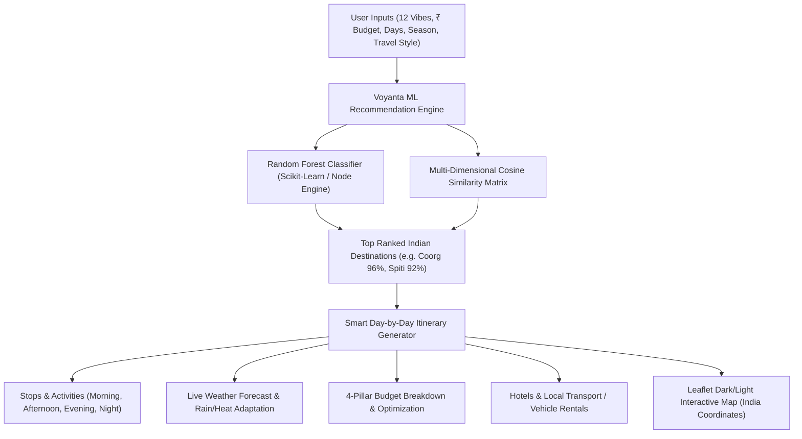

# Voyanta — India-Centric AI & Vibe Travel Platform

Overhaul Voyanta into an authentic, India-exclusive intelligent travel planning platform matching the modern Figma prototype structure (`https://hook-trill-73350106.figma.site`), powered by a **Hybrid Machine Learning Engine (Random Forest Ensemble + Cosine Similarity)**, real database persistence, dynamic notifications, animated authentication, and fully working interactive modules.

---

## User Review Required

> [!IMPORTANT]
> - **Geography**: 100% India-exclusive destinations (Kyoto, Bali, Swiss Alps removed). 50+ Indian destinations across all states (Coorg, Spiti Valley, Manali, Goa, Rishikesh, Udaipur, Munnar, Varanasi, Meghalaya, etc.).
> - **Currency**: All budgets and costs throughout the entire platform are in **₹ (INR)**.
> - **AI Trip Planner Redesign**: As requested, the initial *"Where are you going?"* step is eliminated. The wizard captures the user's desired **Vibes (12 categories)**, **₹ Budget range**, **Duration**, and **Travel style**, and the ML Engine recommends the top Indian destinations with confidence match % and reasoning!
> - **Interactive vs Fake Buttons**: All buttons, filters, tabs, notifications, budget sliders, and itineraries will be fully connected to real state and backend APIs.

---

## Proposed Architecture & ML Strategy



### 12 Vibe Dimensions
1. 🏖️ **Beaches** (Goa, Gokarna, Andaman, Varkala, Pondicherry)
2. 🏔️ **Mountains** (Manali, Spiti Valley, Leh Ladakh, Gulmarg, Ooty, Darjeeling)
3. 🍛 **Food & Culinary** (Delhi, Amritsar, Lucknow, Kolkata, Mumbai, Ahmedabad)
4. 🎭 **Culture & Arts** (Jaipur, Varanasi, Madurai, Hampi, Tanjore)
5. 🏛️ **History & Heritage** (Agra, Udaipur, Khajuraho, Hampi, Jodhpur)
6. 🛍️ **Shopping & Bazaars** (Jaipur, Delhi Chandni Chowk, Mumbai Colaba)
7. 🧗 **Adventure & Trekking** (Rishikesh, Bir Billing, Spiti, Dandeli, Meghalaya)
8. 🌃 **Nightlife & Clubs** (Goa, Mumbai, Bangalore, Pune)
9. 🌿 **Nature & Wildlife** (Coorg, Munnar, Meghalaya, Wayanad, Kaziranga, Jim Corbett)
10. 🙏 **Spiritual & Temples** (Varanasi, Rishikesh, Tirupati, Amritsar Golden Temple, Haridwar)
11. 🧘 **Relaxation & Wellness** (Coorg, Alleppey Houseboats, Gokarna, Varkala)
12. ☕ **Café & Slow Travel** (Dharamkot, Pondicherry White Town, Manali Old Town, Ziro)

---

## Proposed Changes

### Database & Seed Data (`server/src/prisma/`)

#### [MODIFY] [`schema.prisma`](file:///d:/anti-voyanta/server/src/prisma/schema.prisma)
- Update models to support Indian destinations, 12 vibes, real notifications, expenses, travel checklist, reviews, hotels, and vehicle rentals.
- Add `Notification` model (`id`, `userId`, `title`, `message`, `type`, `read`, `createdAt`).
- Add `Hotel` model (`id`, `destinationId`, `name`, `city`, `pricePerNight`, `rating`, `amenities`, `category`, `imageUrl`).
- Add `Vehicle` model (`id`, `destinationId`, `name`, `type`, `pricePerDay`, `rating`, `imageUrl`).
- Add `Expense` model (`id`, `tripId`, `category`, `amount`, `description`, `date`).
- Add `Checklist` model (`id`, `tripId`, `item`, `category`, `completed`).
- Add `Review` model (`id`, `destinationId`, `userId`, `rating`, `comment`, `createdAt`).

#### [MODIFY] [`seed.js`](file:///d:/anti-voyanta/server/src/prisma/seed.js) & [`dataset.json`](file:///d:/anti-voyanta/server/src/ml/dataset.json)
- Populate 50+ real Indian destinations across all Indian states and the 12 vibes.
- Populate Indian hotels (luxury, mid-range, budget) and vehicle rental options.
- Set accurate coordinates, weather cities, and costs in ₹ (INR).

---

### Machine Learning Engine (`server/src/ml/`)

#### [MODIFY] [`train_random_forest.py`](file:///d:/anti-voyanta/server/src/ml/train_random_forest.py)
- Retrain scikit-learn Random Forest model on the updated Indian dataset with 12 vibe indicators.
- Generate feature importances report and accuracy validation for viva presentation.

#### [MODIFY] [`randomForest.js`](file:///d:/anti-voyanta/server/src/ml/randomForest.js)
- Update Node.js ensemble classifier to handle 12 vibe vector inputs and return confidence scores with feature breakdown.

---

### Backend API (`server/src/`)

#### [MODIFY] [`tripController.js`](file:///d:/anti-voyanta/server/src/controllers/tripController.js) & Routes
- Update itinerary generator to generate day-wise plans for Indian cities with local morning/afternoon/evening stops, food spots, and stay recommendations in ₹ INR.
- Add Budget Optimization endpoint (Current vs Optimized budget with money-saving suggestions).

#### [NEW] [`notificationController.js`](file:///d:/anti-voyanta/server/src/controllers/notificationController.js) & Routes
- Get user notifications, mark as read, mark all read, send real system triggers.

#### [NEW] [`servicesController.js`](file:///d:/anti-voyanta/server/src/controllers/servicesController.js) & Routes
- Endpoints for Hotels and Vehicle Rentals across Indian cities with filters.

#### [NEW] [`expenseController.js`](file:///d:/anti-voyanta/server/src/controllers/expenseController.js) & [`checklistController.js`](file:///d:/anti-voyanta/server/src/controllers/checklistController.js)
- Real-time expense tracker and travel checklist management for saved trips.

---

### Frontend UI (`client/src/`)

#### [MODIFY] [`App.jsx`](file:///d:/anti-voyanta/client/src/App.jsx) & Navbar / Footer
- Modern Figma-styled top navigation bar:
  - Voyanta branding + compass/sparkle icon
  - Links: **Home**, **Explore**, **AI Planner**, **Hotels**, **Vehicle Rental**, **Budget Optimizer**, **Dashboard**
  - Real Notification dropdown with live badge and mark-read
  - Real User Profile Avatar with dropdown (My Saved Trips, Profile, Logout)
- Consistent footer with Indian contact (`+91 1800-VOYANTA`, `support@voyanta.com`).

#### [NEW] [`LoginRegister.jsx`](file:///d:/anti-voyanta/client/src/pages/LoginRegister.jsx)
- Sleek, modern animated Auth page with animated card flipping/tab switching, background ambient glow, 1-click Demo login, and real JWT token storage.

#### [MODIFY] [`LandingPage.jsx`](file:///d:/anti-voyanta/client/src/pages/LandingPage.jsx)
- Matching Figma structure:
  - Hero banner with Indian journey messaging and quick vibe pills.
  - Live stats bar: **500+ Destinations**, **50K+ Happy Travelers**, **₹2Cr+ Saved**, **4.9★ Rating**.
  - Popular Indian Destinations grid (Goa, Coorg, Spiti Valley, Udaipur, Manali, Jaipur).
  - Smart Features section.
  - Real traveler reviews.

#### [MODIFY] [`TripPlanner.jsx`](file:///d:/anti-voyanta/client/src/pages/TripPlanner.jsx)
- **Step 1: Select Desired Vibes** (Grid of 12 interactive vibe cards with emojis and micro-animations).
- **Step 2: Set Budget in ₹** (₹5,000 to ₹2,00,000+ interactive slider & tier selector).
- **Step 3: Duration & Travelers** (Days 1–14, Solo / Couple / Family / Friends).
- **Step 4: Season & Travel Style** (Monsoon, Winter, Summer, Cultural, Relaxed, Adventure, Luxury).
- **Step 5: ML Recommendation Results**:
  - Displays top matching destinations with real confidence scores (e.g. *96% Match: Coorg*, *91% Match: Spiti Valley*).
  - Click any destination to generate and view its dynamic Day-by-Day itinerary!

#### [MODIFY] [`ItineraryView.jsx`](file:///d:/anti-voyanta/client/src/pages/ItineraryView.jsx)
- Day-wise timeline (Morning, Afternoon, Evening, Night) with cost in ₹.
- Integrated Hotel stay & Transit cards.
- Live Weather widget with smart rain/heat adaptation.
- Interactive Leaflet dark/light map showing real Indian pins and route polylines.
- Download / Print Itinerary button & Save to My Trips.

#### [NEW] [`Dashboard.jsx`](file:///d:/anti-voyanta/client/src/pages/Dashboard.jsx)
- Personalized traveler dashboard:
  - Welcome greeting with user's real name.
  - Upcoming Trip countdown card.
  - Live Weather widget.
  - Real Budget Summary (Total Budget, Spent, Remaining).
  - Quick action buttons (New Trip, Explore, Budget Optimizer).

#### [NEW] [`ExploreIndia.jsx`](file:///d:/anti-voyanta/client/src/pages/ExploreIndia.jsx)
- Categorized tabs: **Attractions**, **Famous Food & Restaurants**, **Activities**.
- Filter by Indian state, vibe, and budget.

#### [NEW] [`HotelsPage.jsx`](file:///d:/anti-voyanta/client/src/pages/HotelsPage.jsx) & [`VehiclesPage.jsx`](file:///d:/anti-voyanta/client/src/pages/VehiclesPage.jsx)
- Search and filter hotels and vehicle rentals across Indian destinations with real booking modals and add-to-trip actions.

#### [NEW] [`BudgetOptimizerPage.jsx`](file:///d:/anti-voyanta/client/src/pages/BudgetOptimizerPage.jsx)
- Current Budget vs AI-Optimized Budget comparison.
- Smart money-saving swap cards (hotel downgrades/upgrades, public transit vs cabs).

#### [NEW] [`TripTools.jsx`](file:///d:/anti-voyanta/client/src/components/TripTools.jsx)
- **Expense Tracker** (Add expenses in ₹, track by category with progress bar).
- **Travel Checklist** (Pre-populated travel packing checklist based on destination weather & vibes).

#### [NEW] [`AdminDashboard.jsx`](file:///d:/anti-voyanta/client/src/pages/AdminDashboard.jsx)
- Overview of registered users, saved trips, popular destinations, and option to add/edit destinations.

---

## Verification Plan

### Automated Verification
1. **ML Model Training**:
   ```bash
   cd server
   python src/ml/train_random_forest.py
   ```
   Verify classification accuracy and feature importances printout.
2. **Database Migration & Seed**:
   ```bash
   cd server
   npx prisma db push
   node src/prisma/seed.js
   ```
   Verify all 50+ Indian destinations, hotels, vehicles, and demo user are seeded.
3. **Frontend Build**:
   ```bash
   cd client
   npm run build
   ```
   Verify clean, zero-error production build.

### Manual / Browser Verification
1. Test Animated Auth (Login / Register / Demo 1-click).
2. Test AI Trip Planner (Select vibes -> Set ₹ budget -> Duration -> View ML recommendations).
3. Test Day-by-Day Itinerary generation with weather alert adaptation.
4. Test Notifications dropdown (badge updates, mark read).
5. Test Budget Optimizer and Expense Tracker with ₹ calculations.
